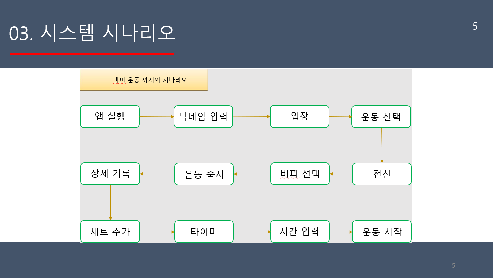
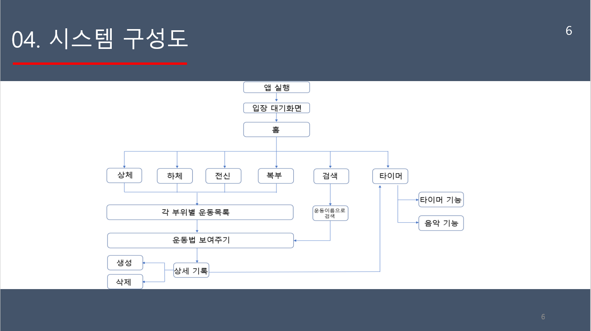

# 2018HealthApp
2018 모바일프로그래밍 팀프로젝트
----------------
###### HealthCare App (KPU_MobileProgramming Lecture TeamProject)

  > 운동 부위별 운동 자세, 효과, 하는 방법, 글로만으론 익힐 수 없는 자세한 시각적인 자료를 통해 자세 안내
  > 타이머 및 음악 지원으로 운동 자극 및 도움
  > 기록 추가 가능
   
--------------------
(1) 개발 환경

	1) Language : JAVA , XML
	2) Tools : Android Studio, SDK, AVR(Android Virtual Device)
	
	
(2) 개발 방법

 	 안드로이드 스튜디오(Android Studio)를 이용하여 개발하고, SDK (Standard Development Kit)
	 에 있는 컴파일러로 실행파일을 만들었습니다.
 	 실행 파일은 달빅 가상머신 환경에서 AVD(Android Virtual Device)를 이용하여 실행시켰습니다.
 	 PPT자료와 책들을 참고하였고, 그 외에 부족한 정보들은 검색들 통해서 참고하였습니다.
	 
	 
(3) 제약 요건

 	 운동 동영상의 저작권 문제, 타이머기능의 음악 저작권 문제
	
(4) 시스템 시나리오
 	
	
(5) 시스템 구성도
 	
	
--------------------
김경섭(팀장-https://github.com/kleg26315/), 최진혁, 정정훈, 이주희
